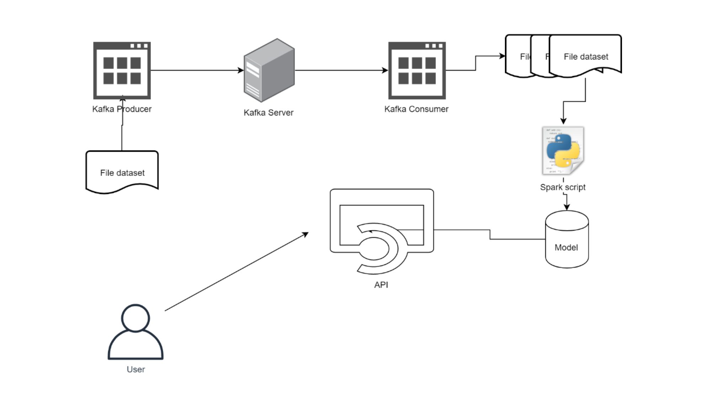
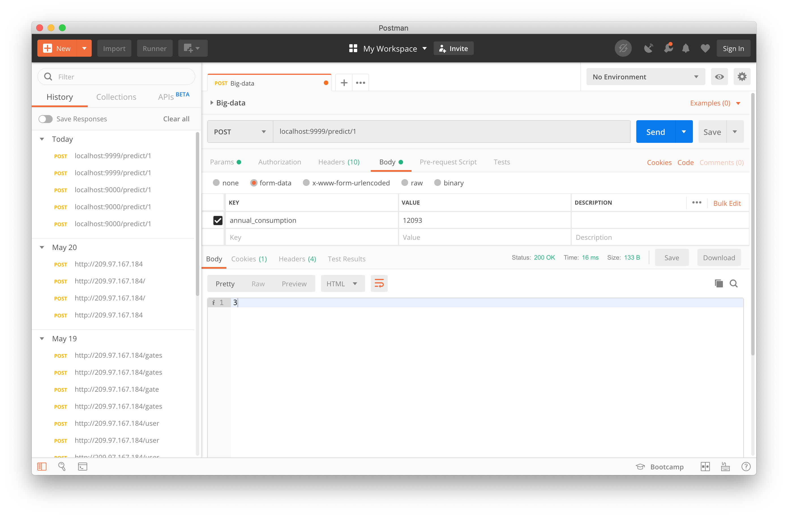
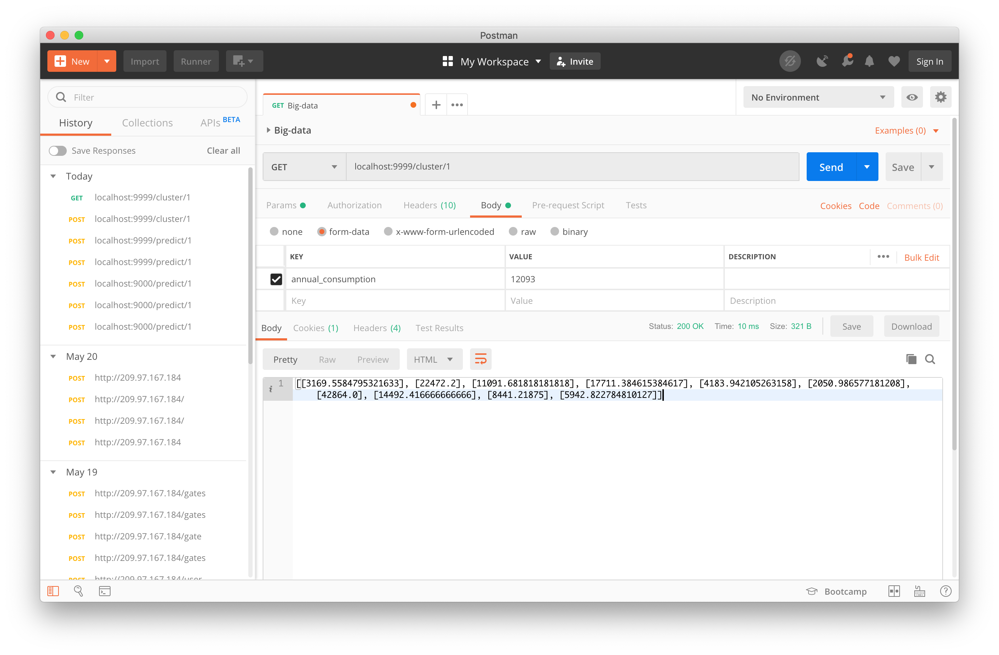

# Final Project Big Data



Terdapat sebuah sistem Big Data dengan arsitektur seperti gambar di atas. Sistem tersebut berfungsi
untuk menyimulasikan pemrosesan data stream menggunakan Kafka dan Apache Spark.
Untuk kemudahan pemrosesan, Kafka Consumer tidak wajib menggunakan Spark Streaming.
Alur yang diharapkan adalah sebagai berikut.
1. Terdapat sebuah file dataset yang akan dibaca secara sekuensial oleh Kafka Producer.
<strong>TIDAK DIPERBOLEHKAN MENGGUNAKAN DATASET YANG SUDAH DIGUNAKAN PADA
TUGAS-TUGAS SEBELUMNYA.</strong>
2. Kafka Producer akan mengirimkan data per baris ke Kafka Server seolah-olah sedang
melakukan streaming. Proses ini dapat dilakukan dengan menambahkan jeda/sleep secara
random agar data tidak dikirimkan secara langsung.
3. Kafka consumer membaca data yang ada di dalam Kafka server dan akan menyimpan data
yang diterima dalam bentuk batch. Batch dapat ditentukan berdasarkan:
    
    - Jumlah data yang diterima

    - Rentang waktu proses (window) Sehingga nanti akan didapatkan beberapa file dataset sesuai dengan batch yang dipilih.

4. Spark script bertugas untuk melakukan training model sesuai dengan data yang masuk.
Diharapkan ada beberapa model yang dihasilkan sesuai dengan jumlah data yang masuk.
Kalian dapat menentukan sendiri berapa jumlah data yang diproses untuk tiap model.
Contoh:

    a. Terdapat 3 model dengan skema sebagai berikut:
    1. Model 1: Menggunakan data selama 5 menit pertama atau 500.000 data pertama.
    2. Model 2: Menggunakan data selama 5 menit kedua atau 500.000 data kedua.
    3. Model 3: Menggunakan data selama 5 menit ketiga atau 500.000 data ketiga.

    b. Terdapat 3 model dengan skema sebagai berikut:

    1. Model 1: 1/3 data pertama
    2. Model 2: 1/3 data pertama + 1/3 data kedua
    3. Model 3: 1/3 data pertama + 1/3 data kedua + 1/3 data terakhir (semua
data)

5. Model-model yang dihasilkan akan digunakan di dalam API. Buatlah endpoint sesuai dengan
jumlah model yang ada.
6. User akan melakukan request ke API. API akan memberikan respon sesuai dengan request
user.
Misal:
    - Apabila user melakukan request rekomendasi, maka input yang diperlukan adalah rating dari user dan response yang diberikan adalah daftar rekomendasi.
    - Apabila modelnya adalah kasus clustering, maka response yang diberikan adalah ada di cluster mana data input dari user tersebut.

# Deskripsi Aplikasi

# DUTCH ELECTRIC CONSUMPTION CLUSTERING SYSTEM

Sebuah aplikasi REST API yang berguna untuk membuat cluster dari konsumsi listrik di belanda. Aplikasi dibangun menggunakan algoritma K-MEANS pyspark yang di serve sebagai API mengguakan flask. Data yang didapat merupakan hasil dari proses streaming data melalui Kafka.

## Aplikasi terdiri dari 2 bagian

> Kafka Server
- producer.py : sebagai publisher yang berfungsi mengirimkan dataset kepada suatu topic pada kafka server
- consumer.py : sebagai subscriber yang berfungsi menerima data hasil streaming dari suatu topic pada kafka server
> Clustering System
- app.py : sebagai api route controller dari flask
- engine.py : sebagai clustering engine yang memanfaatkan K-Means Clustering pyspark
- server.py : sebagai start point yang menghubungkan app.py dan engine.py serta menjalankannya diatas cherrypi sebagai web server

## Cara menggunakan : 
- jalankan zookeper
    > bin/zookeeper-server-start.sh config/zookeeper.properties
- jalankan kafka server
    > bin/kafka-server-start.sh config/server.properties     
- jalankan producer.py untuk mengirim data
    > python producer.py
- jalankan consumer.py untuk menerima data
    > python consumer.py
- jalankan flask server sebagai API dengan python3
    > python3 server.py

- akses API pada http://<ip_address>:9999/{api}

## Endpoint aplikasi
- /predict/\<model_id> **[POST]** \{parameter int(annual_consumption)}

contoh : 
```
    curl -d "annual_consumption=12093" -X POST http://localhost:9999/1
```


- /cluster/\<model> **[GET]**

contoh :
```
    curl http://localhost:9999/1
```


### sources:

- https://towardsdatascience.com/kafka-python-explained-in-10-lines-of-code-800e3e07dad1
- https://towardsdatascience.com/getting-started-with-apache-kafka-in-python-604b3250aa05
- https://stackoverflow.com/questions/46001807/dump-the-kafka-kafka-python-to-a-txt-file
- https://spark.apache.org/docs/2.3.0/sql-programming-guide.html
- https://pandas.pydata.org/pandas-docs/stable/reference/api/pandas.DataFrame.to_json.html

